# High-Frequency ETF Sharpe Ratio Analysis

Understanding intraday market behavior is crucial for traders, quantitative analysts, and algorithmic systems that operate at high speeds. While daily returns provide general trends, they often obscure the microstructure of volatility, momentum, and risk-adjusted performance that occur minute-by-minute. This project aims to bridge that gap by analyzing **minute-level returns across four major U.S. ETFs** over a long time horizon.

The dataset includes **minute-by-minute price data for 390 trading minutes per day**, spanning **479 trading days between May 1, 2007 and February 27, 2009**. This time period captures both stable and volatile market conditions, including the 2008 financial crisis.

---

## 🎯 Objective

We investigate **how price behavior evolves within a trading day**, minute by minute, by computing the following for each ETF:

- **Mean returns**  
- **Variance** of returns  
- **Standard deviation** (volatility proxy)  
- **Daily Sharpe Ratios** (risk-adjusted return)
- **Cumulative Sharpe Ratios** across time

---

## 📊 ETFs Analyzed

- **DIA** – SPDR Dow Jones Industrial Average ETF Trust  
- **IWM** – iShares Russell 2000 ETF  
- **QQQ** – Invesco QQQ Trust (tracks Nasdaq-100)  
- **SPY** – SPDR S&P 500 ETF Trust

---

## 📈 Minute-Wise Mean Returns

These plots show the average normalized return for each trading minute across all 479 days.

### DIA – SPDR Dow Jones Industrial Average ETF
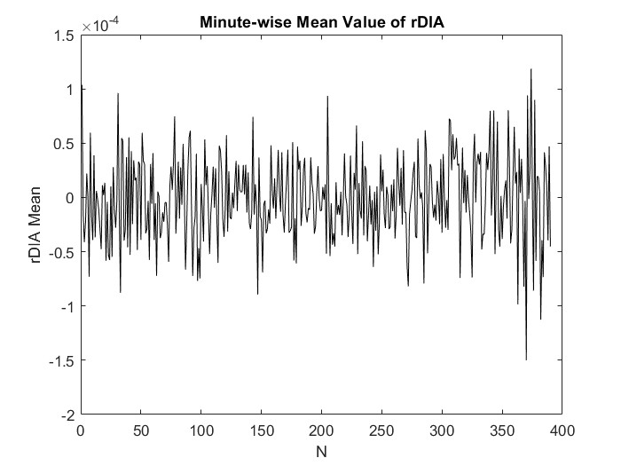

### IWM – iShares Russell 2000 ETF
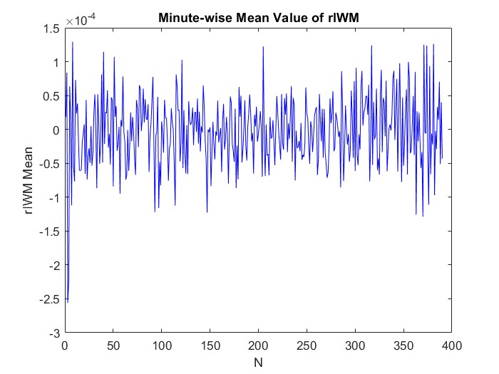

### QQQ – Invesco QQQ Trust
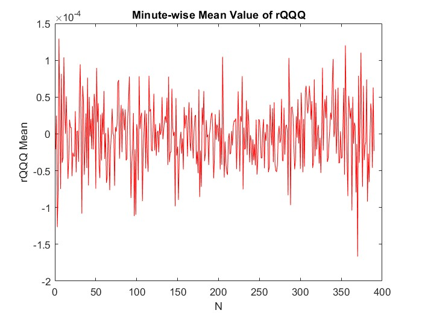

### SPY – SPDR S&P 500 ETF Trust
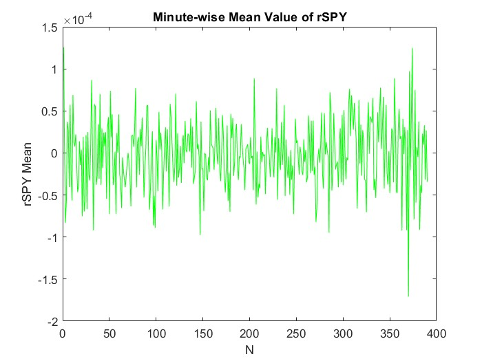

---

## 🔁 Minute-Wise Return Variance

Variance measures how much the returns deviate from their mean at each minute.

### DIA – SPDR Dow Jones Industrial Average ETF
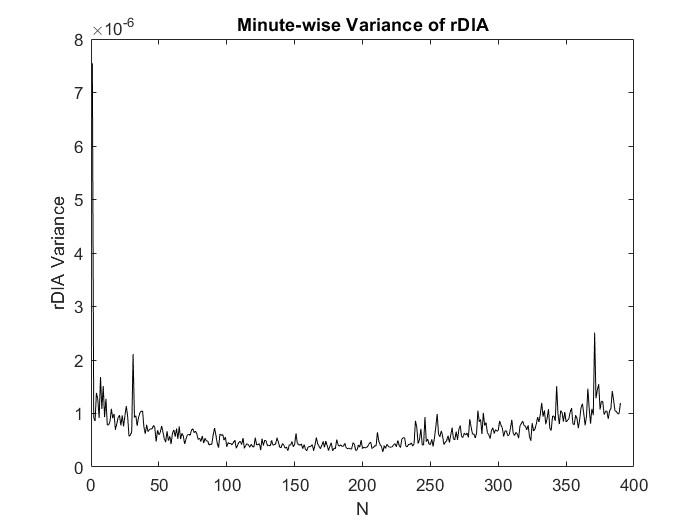

### IWM – iShares Russell 2000 ETF
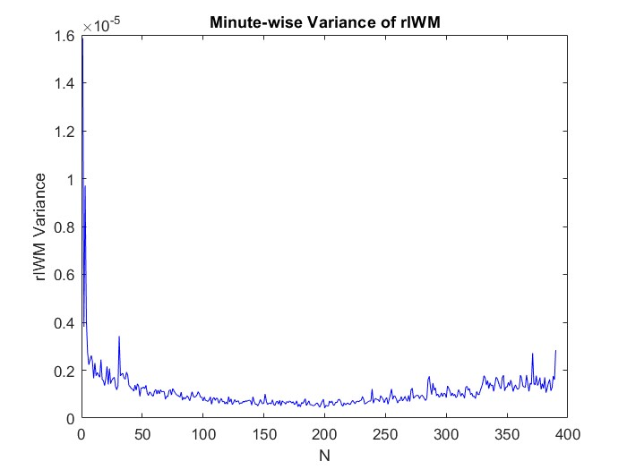

### QQQ – Invesco QQQ Trust
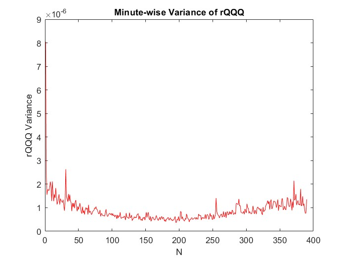

### SPY – SPDR S&P 500 ETF Trust
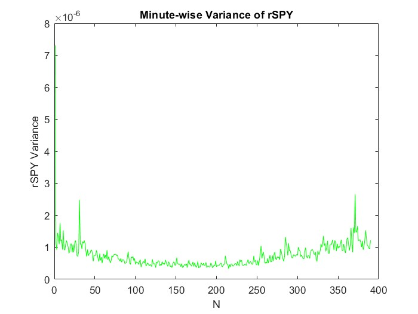

---

## 📉 Minute-Wise Standard Deviation

Standard deviation serves as a volatility indicator across intraday time.

### DIA – SPDR Dow Jones Industrial Average ETF
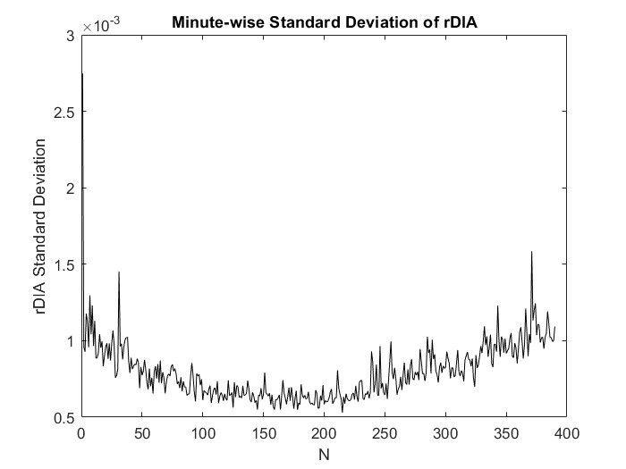

### IWM – iShares Russell 2000 ETF
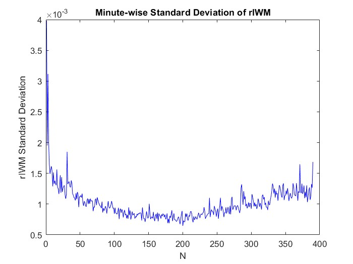

### QQQ – Invesco QQQ Trust
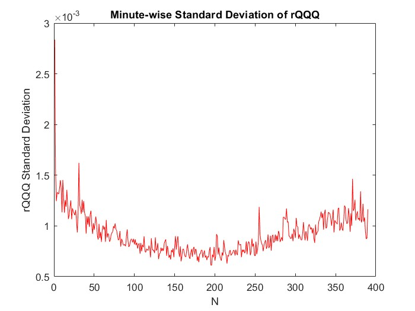

### SPY – SPDR S&P 500 ETF Trust
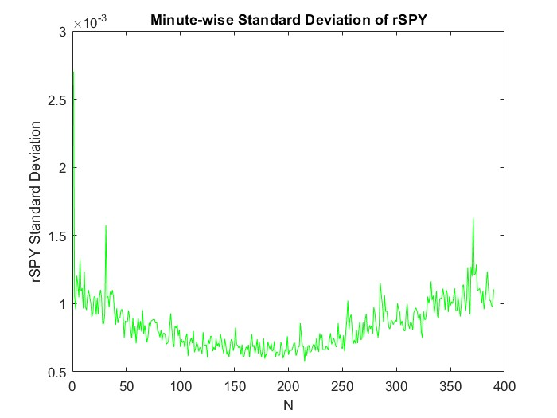

---

## ⚖️ Daily Sharpe Ratios (Per ETF)

The Sharpe ratio is calculated daily for each ETF to quantify the **risk-adjusted return**.

### DIA – SPDR Dow Jones Industrial Average ETF
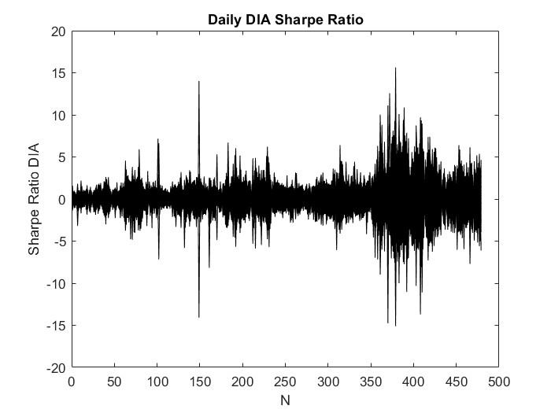

### IWM – iShares Russell 2000 ETF
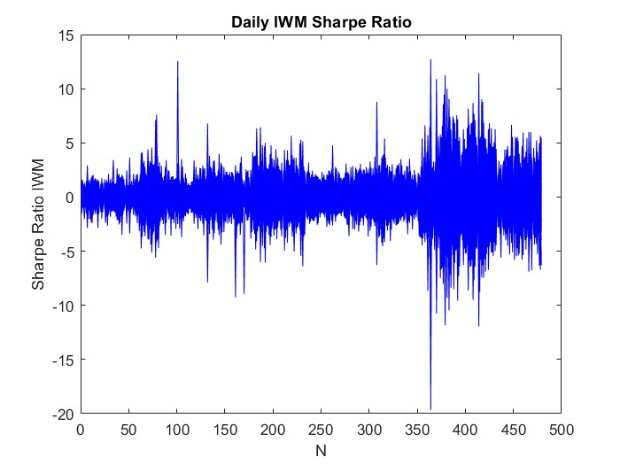

### QQQ – Invesco QQQ Trust
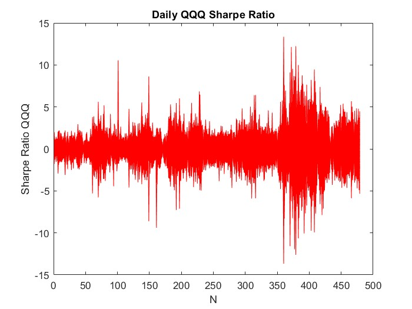

### SPY – SPDR S&P 500 ETF Trust
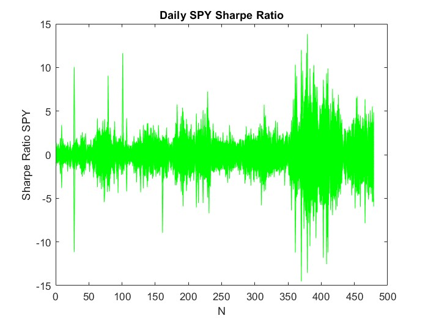

---

## 📈 Cumulative Mean of Sharpe Ratios

This plot aggregates the mean of daily Sharpe ratios across time, illustrating overall trend.

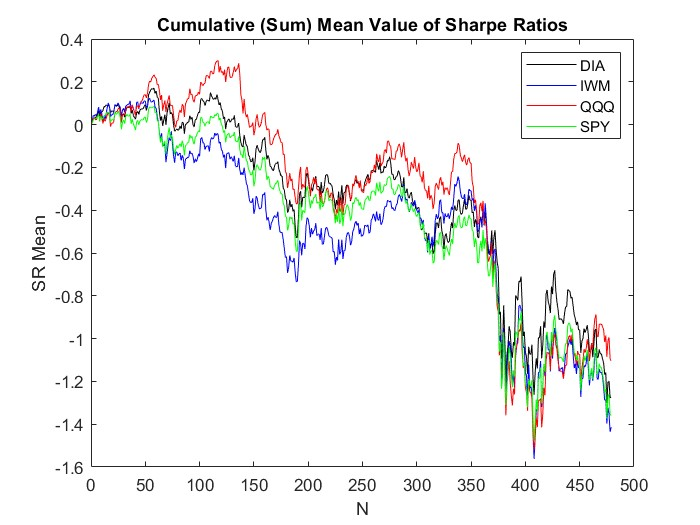

---

## 📊 Daily Sharpe Ratio Standard Deviation

This plot shows the standard deviation of the daily Sharpe ratios across time, indicating the volatility of risk-adjusted returns.

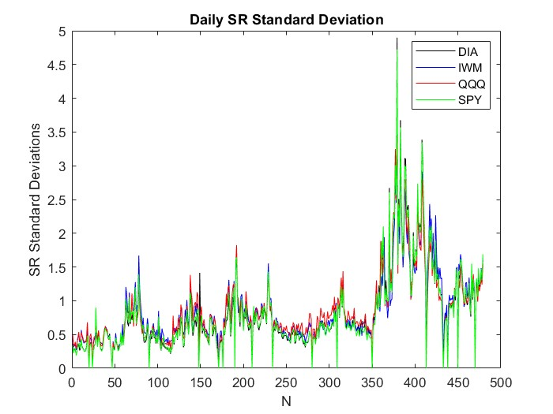

---

## 📂 Files in This Project

- `High_Freq_ETF_Analysis.m` – MATLAB script for return/statistical computations  
- `4INDEX-1MIN-05012007-02272009.xlsx` – Raw minute-level ETF price data  
- `plots/` – Contains all the images used above

---

## 📌 Key Takeaways

- Volatility tends to spike near the **open and close** of trading days.
- Return variance is relatively low mid-day for most ETFs.
- Daily Sharpe Ratios show extreme swings, especially during high-volatility periods (late 2008).
- QQQ and SPY often lead in cumulative Sharpe ratio growth early in the day before converging.

---

## 📊 Formulas Used

1) Normalized return at minute \( n \):

- p(n) represents the price at minute n. This calculation is performed with our Np value set to 391, meaning that the total number of one-minute intervals in a trading day (from 9:00 AM to 4:00 PM) is 391. 
For each ETF—DIA (Dow Jones), IWM (iShares Russell), QQQ (Invesco), and SPY (S&P 500)—we calculate three key statistics:

- Mean return per minute: This is the mean/average normalized return at each particular minute of the trading day, throughout all days. The mean return per minute tells us whether there's a tendency for prices to rise or fall during specific periods (for example, right after the market opens or right before it closes).

- Variance per minute: The variance (m2 - m12) tells us how widely the returns are distributed out from the mean at each minute. The higher the variance is, the more inconsistent the price behavior is at a specific minute over various days, and the lower it is, the closer the returns are to the mean.

- Standard deviation per minute: The STD is the square root of variance (σ), and we use it to directly measure volatility. If the our standard deviation is high, then it means that the ETF’s price is more volatile, indicating that it is fluctuating significantly at a certain point in the day (or throughout the day, if done daily). 

2) Sharpe Ratio

   

- r(n) is our normalized return at time n

- (n) is the standard deviation of returns, representing risk

Using this ratio, I was able to quantify how much return an asset provides per unit of risk. It is also crucial for comparing different investment options on a fair, normalized scale.

To calculate the Sharpe ratios for each day, I used the minute-wise return matrices for each ETF (DIA, IWM, QQQ, SPY). Then, I divided the returns by their corresponding standard deviations to calculate the Sharpe Ratio for each minute of each day.
Then, I simply averaged these minute-wise Sharpe Ratios across each day to create a daily Sharpe Ratio time series over 479 (n = 1, 2, … 479) trading days with W = Np = 391. 

## 🔚 Conclusion

Overall, I found this project very useful for analyzing ETF growth and decay, as well as applying the knowledge we gained from ECE 321 so far. 
I got to see what plots of Mean/Expected Value (E[X]), Variance (m2 - m12), and well as Standard Deviation (σ) look like, and how they are applicable to the real-world. 
In this project, I explored the day-to-day and minute-by-minute performance of 4 major ETFs—DIA (Dow Jones), IWM (iShares Russell), QQQ (Invesco), and SPY(S&P 500)—
during the tumultuous period between May 1, 2007, and February 27, 2009. By leveraging high-frequency minute-by-minute price data, I derived the normalized returns and 
used the Sharpe Ratio (SR) to assess each ETF’s risk-adjusted performance.  

Through my analysis, I found that ***QQQ (Invesco) came on top by consistently outperforming the rest of the ETFs***, exhibiting the ***highest average daily Sharpe Ratio*** and the ***most favorable 
cumulative risk-return profile*** across the 479 trading days. Conversely, ***IWM (iShares Russell) showed the weakest performance***, with the ***lowest overall Sharpe Ratio*** and ***higher volatility (the STD was larger)***. 
Through these results, I was able to understand how analytical, financial, and statistical tools can be utilized for high-frequency data to derive calculated and informed conclusions about the 
correct investment decisions to make, especially during times of increased market turbulence, such as from 2007 to 2009. 

